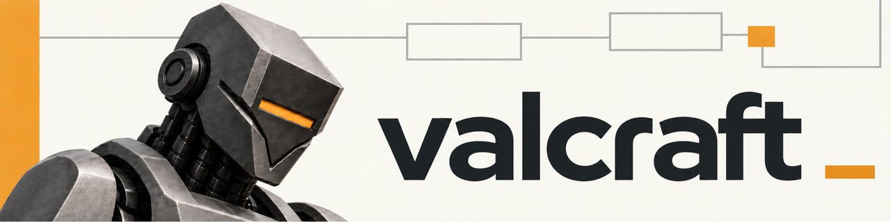

<!-- markdownlint-disable-next-line MD041 -->
<p align="center">
  
</p>

A software factory in your repository.

Valcraft is a set of skills for coding agents. You describe what needs to be built; Valcraft coordinates planning, implementation, and independent review. The requirements, decisions, and progress stay with your code.

You spend less time managing handoffs between agents. Work can continue across sessions and be shared with your team.

The skills run in Claude Code, OpenAI Codex, Cursor, or OpenCode, with no separate Valcraft executable or background service. The Claude Code plugin includes one small shell hook that keeps an unattended run from stalling. Valcraft is in alpha. See [installation and platform support](#install).

[Get started](#start-with-one-assignment) · [Skills at a glance](#skills-at-a-glance) · [Documentation](#documentation)

## What changes when you build with Valcraft

- Before coding starts, Valcraft turns your assignment into written requirements, acceptance criteria, and ordered tasks. Stable IDs link those requirements to plans, commits, tests, and reviews, so you can trace why a change exists and how it was checked.
- Foreman handles the handoffs between agents. It dispatches workers and separate reviewers, reads their reports, and chooses the next step. It sends findings back for fixes and brings unresolved questions to you.
- After the implementing agent runs its verification, a separate reviewer checks the change against the requirements. Findings need reproduced evidence. Fixes are checked again before the work can proceed to merge.
- Land checks that the passing review covers the current pull request head. A change after review sends the pull request back to review.
- Workers start each step with fresh context from project files. Foreman reads the report sections it needs to coordinate the work. A new session can recover that state from the files without inheriting the previous conversation.
- Draft applies MSW to each plan: if removing a step still leaves the assignment fulfilled and verified, that step goes. Smaller changes can use one quick-task file instead of a full feature specification.
- Temper examines a completed feature and proposes changes to how future work is done. A separate reviewer checks its retrospective. Applying a proposal takes separate work; the retrospective leaves your project rules unchanged.

This is spec-driven development: write down what the software must do, then plan, build, and check against that record. The process applies whether you write code yourself or prompt agents to build it. [How Valcraft works](docs/how-it-works.md) describes the data model, the owner of each file, and every step of the loop.

## Is it for you?

Valcraft fits projects you return to across sessions or share with teammates, especially when features have requirements to verify. Planning and independent reviews use agent work and tokens. They aim to catch mistakes and reduce repeated explanations and rework, but the total time and cost depend on the task.

For a throwaway script, the full cycle may be more process than you need. You can adopt one piece first: use Review on an existing pull request, Draft to plan a defined task, or Cast to give an existing project its rules and structure. A quick task keeps a smaller change's specification in one file while retaining the delivery and review steps.

Expect rough edges and changes between releases while Valcraft is in alpha.

## Start with one assignment

[Install Valcraft](#install), open your project's repository in your coding agent, and describe something you already need to ship. A requirements document such as `docs/prd.md` can be the starting point. Include the behavior you need, the constraints that matter, and how you will know it works.

1. Ask Valcraft Cast to set up the repository. It creates or adapts the project rules, product brief, and directories for decisions and specifications. If configuration is missing, Cast invokes Tune to guide you through it. Spec writes the feature specification in the next step.
2. Give Valcraft Spec your requirements document. It writes the requirements and acceptance criteria, the technical approach, and the tasks with their dependencies. For a small change, ask for a quick task. Resolve open product decisions before implementation.
3. Ask Valcraft Foreman to work through the resulting tasks. It inspects the project and asks you to confirm where it should begin. It then dispatches workers and reviewers under your chosen approval mode.

Foreman coordinates the task cycle below. Each step has a responsible agent and a result that can be checked.

```text
Plan → Review → Implement and verify → Review → Merge
         ↓                               ↓
      Revise plan                    Fix and re-check
```

Before task delivery, Foreman coordinates review and publication of the specification. After you confirm a feature is complete, it coordinates a retrospective and its review. Foreman uses worker reports to decide what happens next; the workers do the planning, coding, review, and merging.

Run these commands in sequence as each step completes. You can learn the other skills as you need them.

```text
/valcraft-cast
/valcraft-spec docs/prd.md
/valcraft-foreman
```

If the project already uses Valcraft, start a new feature with Spec. Foreman can also take over work you began with the individual skills.

## Choose how much coordination to hand over

Attended mode pauses for task selection, passing reviews, and operations that need your approval. Unattended mode advances routine steps, including authorizing prepared pushes, pull requests, and ordinary merges into the default branch. Both modes require review.

Some decisions wait for you in either mode. [How Valcraft works](docs/how-it-works.md#approval-modes-and-authority) lists where your approval is required.

You can also run the skills one by one and handle the handoffs yourself. The written requirements, plans, independent reviews, and verification stay the same. You get more control at the cost of more attention. You can learn the skills this way before handing coordination to Foreman.

Workers run as native subagents in Claude Code, Codex, or Cursor, as fresh coding agents in Herdr panes, or as Agent Orchestrator sessions with a worktree each. [Where the workers run](docs/how-it-works.md#where-the-workers-run) compares the three.

## Keep the project ready for the next session or teammate

Requirements, acceptance criteria, design decisions, plans, and tasks are ordinary Markdown files in git. You can read and edit them with your usual tools and follow their history. The files remain useful if you remove Valcraft.

Cast records the project rules in `AGENTS.md`, where agent sessions read them even when Foreman is not running. Those rules tell agents to cite the same requirement IDs and update affected specifications or decision records alongside their changes.

Task tracking can stay local as checkboxes in the repository. Teams can also use GitHub Issues to see feature tasks and their status in one place. The repository remains the source of requirements; quick tasks always track locally.

A teammate can continue from the work you have pushed. Foreman proposes where to continue and asks for confirmation.

Team settings live in the committed configuration. Tune can also save personal approval and backend choices in a local overlay, so teammates can work differently without changing the shared settings.

## Skills at a glance

| Skill | What it helps you do |
| --- | --- |
| [Cast](plugins/valcraft/skills/valcraft-cast/SKILL.md) | Scaffold a new project or add the structure to an existing one. |
| [Spec](plugins/valcraft/skills/valcraft-spec/SKILL.md) | Turn requirements into a feature specification or a quick task. |
| [Foreman](plugins/valcraft/skills/valcraft-foreman/SKILL.md) | Coordinate delivery or pick up work already in progress. |
| [Draft](plugins/valcraft/skills/valcraft-draft/SKILL.md) | Plan one task and remove work the assignment does not need. |
| [Forge](plugins/valcraft/skills/valcraft-forge/SKILL.md) | Implement a reviewed task, verify it, and address review findings. |
| [Review](plugins/valcraft/skills/valcraft-review/SKILL.md) | Independently check a specification, plan, code change, or completion evidence. |
| [Land](plugins/valcraft/skills/valcraft-land/SKILL.md) | Verify review coverage and applicable checks, perform authorized merges, and close the task. |
| [Temper](plugins/valcraft/skills/valcraft-temper/SKILL.md) | Review what happened during a completed feature and propose lessons for future work. |
| [Tune](plugins/valcraft/skills/valcraft-tune/SKILL.md) | Configure task tracking, approval mode, and how workers run. |
| [Hone](plugins/valcraft/skills/valcraft-hone/SKILL.md) | Refine a prompt, skill, or agent instruction file. |
| [Distill](plugins/valcraft/skills/valcraft-distill/SKILL.md) | Reduce a prompt or skill while preserving the behavior it needs. |
| [MSW](plugins/valcraft/skills/valcraft-msw/SKILL.md) | Check a document against its purpose and remove unnecessary work. |

Every skill uses the name `valcraft-<skill>`. Invoke it as `/valcraft:valcraft-<skill>` in Claude Code, `$valcraft:valcraft-<skill>` in Codex, or `/valcraft-<skill>` in Cursor. OpenCode loads the bare name through its `skill` tool. Natural requests can also trigger skills. In Cursor, use `/valcraft-review` for Valcraft Review; `/review` is Cursor's built-in command.

The MSW Kernel is by "Fable at mega high monkey effort", published by [@aienginerd](https://x.com/aienginerd/status/2085342869850603672).

## Install

Choose the application you use for coding agents. Foreman's native subagent backend is available in Claude Code, Codex, and Cursor. OpenCode currently supports the individual skills without a Foreman worker backend. Installing through Cursor's marketplace requires a Teams or Enterprise plan and permission to import a marketplace.

<details open>
<summary>Claude Code</summary>

```bash
claude plugin marketplace add valzav/valcraft
claude plugin install valcraft@valcraft
```

The Claude Code plugin registers one Stop hook, a POSIX shell script. It keeps a Foreman controller or a Cast run from ending its turn in the middle of a run, and it lets every other session stop. See [docs/development.md](docs/development.md#packaging).

</details>

<details open>
<summary>OpenAI Codex</summary>

```bash
codex plugin marketplace add valzav/valcraft
codex plugin add valcraft@valcraft
```

Start a new Codex session afterwards.

</details>

<details>
<summary>Cursor</summary>

Import the repository from the team dashboard under **Plugins → Add Marketplace**, or use the CLI:

```bash
agent plugin marketplace add https://github.com/valzav/valcraft
```

Then install `valcraft` from the Cursor Plugins UI. The CLI has no `plugin install` command. Use the repository as the marketplace source, not a skill directory.

</details>

<details>
<summary>OpenCode</summary>

Add the skills source to your project or global `opencode.json`:

```json
{
  "$schema": "https://opencode.ai/config.json",
  "skills": {
    "urls": [
      "https://raw.githubusercontent.com/valzav/valcraft/main/plugins/valcraft/skills/"
    ]
  },
  "permission": { "skill": "allow" }
}
```

The URL requires a public repository. To load from a clone, use `"skills": { "paths": ["/path/to/valcraft/plugins/valcraft/skills"] }` instead.

</details>

### Updating

<details>
<summary>Update commands and reload behavior</summary>

Claude Code:

```bash
claude plugin marketplace update valcraft
claude plugin update valcraft@valcraft
```

Codex, followed by a new session:

```bash
codex plugin marketplace upgrade valcraft
codex plugin add valcraft@valcraft
```

Cursor:

```bash
agent plugin marketplace update valcraft
```

Then install or update Valcraft in the Plugins UI. If the new version does not appear, remove and re-add the marketplace before updating the plugin.

OpenCode refreshes the source at startup and downloads skills whose version changed. A marketplace installation is a cached copy; edits in a local clone do not update it.

After upgrading Valcraft, run Tune to apply any configuration changes your project needs. See the [migration reference](plugins/valcraft/skills/valcraft-tune/references/migrations.md).

</details>

## Documentation

- [How Valcraft works](docs/how-it-works.md): the data model, artifact owners, each step of the loop, required approvals, backends, and recovery.
- [Configuration](plugins/valcraft/skills/valcraft-tune/references/config.md): shared settings, personal overrides, and setup choices.
- [Glossary](docs/glossary.md): project files, roles, and terms used by the skills.
- [Models and presets](plugins/valcraft/skills/valcraft-tune/references/models.md): model choices for worker roles.
- [Development guide](docs/development.md): contributing, live editing, packaging, and evaluations. Pull requests are welcome; the repository's lint checks must pass.

## Feedback and contact

Report problems through [GitHub Issues](https://github.com/valzav/valcraft/issues). Follow the project on [Telegram](https://t.me/valcraftlab) or [X](https://x.com/valzav), or email [i@valzav.com](mailto:i@valzav.com).

## License

[MIT](LICENSE).
